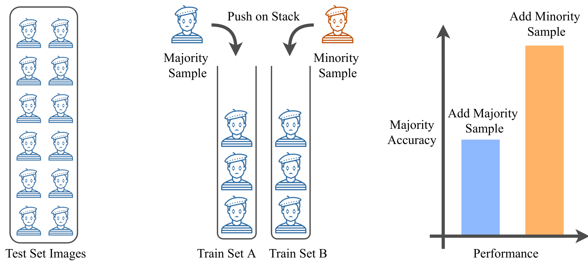

# MIME: Minority Inclusion for Majority Group Enhancement of AI Performance
Pradyumna Chari, Yunhao Ba, Shreeram Athreya, Achuta Kadambi

University of California, Los Angeles, USA

Project webpage
----------------
https://visual.ee.ucla.edu/mime.htm/

Citation
---------

```
@InProceedings{chari2022mime,
      author={Pradyumna Chari and Yunhao Ba and Shreeram Athreya and Achuta Kadambi},
      title={MIME: Minority Inclusion for Majority Group Enhancement of AI Performance},
      booktitle={ECCV},
      year={2022}
}
```

A. INTRODUCTION
-------------


<p align="center">
  
</p>

<p align="center" width="700">
Inclusion of minorities can improve performance for majorities. We theoretically describe an effect called Minority Inclusion, Majority Enhancement (MIME). The figure depicts test classification of blue mimes, and an initial training stack, also of blue mimes. If allowed to add one more training sample, it can be better to push an orange mime onto the training stack rather than a blue mime. Test accuracy can increase by pushing orange, even though the test set consists of blue mimes alone.
</p>

Several papers have rightly included minority groups in artificial intelligence (AI) training data to improve test inference for minority groups and/or society-at-large. A society-at-large consists of both minority and majority stakeholders. An oft-held misconception is that minority inclusion does not increase performance for majority groups alone. In this paper, we make the surprising finding that including minority samples can improve test error for the majority group. In other words, minority group inclusion leads to majority group enhancements (MIME) in performance. A theoretical existence proof of the MIME effect is presented and found to be consistent with experimental results on six different datasets.

This GitHub repository provides access to the code used for the primary results of the paper. Please follow the instructions listed out below to generate appropriate results.

B. SETTING UP THE EXPERIMENTS
------------

FairFace
----------
Notebook for training: FairFace_Model_Training.ipynb

Requirements:
Train labels csv file: fairface_label_train.csv
Test labels csv file: fairface_label_val.csv
Images: fairface-img-margin025-trainval containing the images.
Fixed model initialization: model_init_2class.pt (to be added by user)

All requirements should be in the same directory as the training notebook.

Link to dataset: https://github.com/dchen236/FairFace


Pet Images
-------------
Notebook for training: PetImages_Model_Training.ipynb

Requirements:
Training data folder: data
Fixed model initialization: resnet34_imp_2class.pt (to be added by user)

All requirements should be in the same directory as the training notebook.

We use a manually annotated subset of the original dataset. Link to our annotated dataset: https://drive.google.com/drive/folders/1xH3OsuMrA2UuxqQ8PvqCsyXTIWwBR02L?usp=sharing


UTKFace
----------
Notebook for training: UTKFace_Model_Training.ipynb

Requirements:
Training data folder: UTKFace
Fixed model initialization: model_init_9class.pt (to be added by user)

All requirements should be in the same directory as the training notebook.

Link to dataset: https://susanqq.github.io/UTKFace/ (Aligned and cropped faces)


Chest-Xray14
---------------
Notebook for training: Xray_Model_training.ipynb

Requirements:
Data folder paths: data/Atelectasis/Male, data/Atelectasis/Female, data/Pneumothorax/Male, data/Pneumothorax/Female
Key to the subset of images we have used: Chest-Xray14 dataset details.csv
Fixed model initialization: resnet34_imp_2class.pt (to be added by user)

All requirements should be in the same directory as the training notebook.

Link to full dataset: https://nihcc.app.box.com/v/ChestXray-NIHCC


Adult (Census)
----------------
Notebook for training: Adult_Model_training.ipynb

Requirements:
Training data folder: data (provided)
Fixed model initialization: model2_init_2class.pt (to be added by the user)

All requirements should be in the same directory as the training notebook.

Dataset provided in the directory (adults.csv)


UTKFace-Chicken gender classification
----------------------------------------------
Notebook for training: Chicken_Model_training.ipynb

Requirements:
Data folder paths: dataset/humans, data/chicken/male, data/chicken/female
dataset/humans is the UTKFace dataset folder (renamed to 'humans')
dataset/chicken is the Chicken gender dataset folder, with cock renamed to male, hen renamed to female. Train and test splits are combined and any redundant files are removed.

Fixed model initialization: model_init_2class.pt (to be added by the user)

All requirements should be in the same directory as the training notebook.

Link to (chickens) dataset: https://drive.google.com/drive/folders/1eGq8dWGL0I3rW2B9eJ_casH0_D3x7R73


Plotting the Results
-----------------------
plot_results.pynb- Notebook to plot the trends after completion of runs. Instructions to use included in the notebook.
Depending on the dataset, the following sections may need to be changed:

1. All the checkpoints directories for each trial must be located in a directory named 'all_checkpoints'.
2. The variable named label- guidance provided in notebook comments.
3. The variables named name_save_majority and name_save_minority- guidance provided in notebook comments.
4. The definition of the variable l_dash must be changed based on the dataset- guidance provided in notebook comments.


C. RUNNING THE EXPERIMENTS
---------------------
1. For each dataset, the file structure is to be created according to the above instructions.

1. For each dataset, the concerned notebook is run across several trials (5 trials for all datasets except the NIH Chest-Xray14 dataset, which is run for 7 trials).

2. Each trial is characterized by the random seed used (included in the supplementary materials document).

3. For all minority training ratios for a particular trial, a fixed set of initialization weights are used so that the only differences visible in performance are due to train set configuration. This initialization may be generated by the user manually, and stored according to the naming convention provided. This will be automatically loaded by the notebook.

4. Each trial produces results in a folder named 'checkpoints'. This is to be renamed and the checkpoints folders for all trials are to be stored in a folder named 'all_checkpoints'. Trends may be plotted using the plot_results.ipynb notebook.
